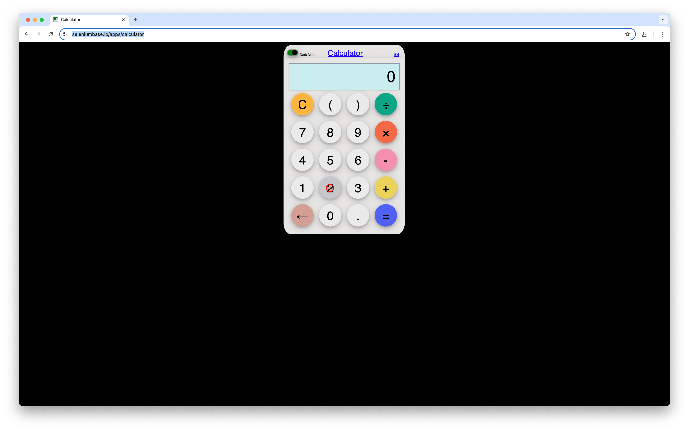

:::note[TLDR]
The open-source AI test automation landscape is growing, featuring three main approaches:

- **Test Generators**: Create test code from descriptions (good for starting, but generated code needs manual maintenance).
- **Test Runners**: Use AI to execute tests based on high-level goals at runtime (easy tests, resilient to UI changes, but often slow & expensive).
- 👉 **Test Libraries** _(my personal preference)_: Integrate AI capabilities as functions within your existing test code (flexible for existing projects, allows gradual adoption, balances AI help with control).

While challenges in stability, performance, and cost remain for all, AI holds significant potential to reduce the burden of UI test maintenance, and the field is just beginning.
:::

AI is quickly reshaping software test automation, with open-source solutions emerging alongside commercial tools. As a test engineer maintaining Selenium tests, I faced confusion about these AI options: what exists, how they fit my workflows, their capabilities, reliability, speed, and cost. Finding no clear answers, I researched hands-on.

This post breaks down the current state of open-source AI in test automation into three areas: test generators, test runners, and test libraries. I'll cover these approaches, pros/cons with specific projects, and evaluate them using a simple "2+2=4" [web calculator][3] test. Note that this guide focuses strictly on test automation tools, excluding general browser agents.

:::tip[Prefer video content?]
_This post is a detailed write-up of the topic I presented at [SeleniumConf 2025][1] and a [webinar][2]._
:::

## Test Generators

We know that AI is good at generating code, so one of the most obvious approaches for using LLMs in test automation is to ask them to write test code based on a specification. This is exactly what test generators do. Here's how they work:

1. You provide a test scenario and the URL of the application you want to test.
2. The tool launches a browser, reads the scenario, and uses AI to determine what code should be written to complete the test.
3. It tries to execute this code until the test passes or fails.
4. Finally, it outputs the generated test code. You can then review, refactor, commit, and run this code like any other test script.

Let’s take a look at a concrete example: the [LaVague][4] project. It defines itself as a web agent framework, but it also has a QA library that is designed specifically for test automation. It takes a Cucumber feature and generates Python tests using Selenium. A “2+2=4” test can be generated with LaVague QA quite easily.

We start by installing the project and giving it access to OpenAI API:

```bash
❱ pip install lavague-qa
❱ export OPENAI_API_KEY="sk-proj-..."
```

Next, we create a Cucumber feature file with the following contents:

```gherkin
# calculator.feature
Feature: Calculator
  Scenario: Addition
    Given the user is on the homepage
    When I perform "2 + 2 ="
    Then the calculator value should be 4
```

The test is quite self-explanatory, so there is no need to go over it. Now, we need to run the command-line tool that will start the browser and generate the test from our scenario:

```bash
❱ lavague-qa --url https://seleniumbase.io/apps/calculator --feature calculator.feature
... (truncated)
Finished generating tests in 29.3s

   Feature file: ./generated_tests/calculator.feature
   Pytest file:  ./generated_tests/calculator.py

Run the following command to execute your tests:

   pytest ./generated_tests/calculator.py
```

The test generation took about **30 seconds**, and OpenAI charged me **$0.08** for GPT-4o model usage. At this point, we have a generated test we can inspect:

<details>
<summary>Click to see lengthy test code.</summary>

```python
# generated_tests/calculator.py
import pytest
from pytest_bdd import scenarios, given, when, then
from selenium import webdriver
from selenium.webdriver.common.by import By
from selenium.webdriver.support.ui import WebDriverWait, Select
from selenium.webdriver.support import expected_conditions as EC

# Constants
BASE_URL = 'https://seleniumbase.io/apps/calculator'

# Scenarios
scenarios('calculator.feature')

# Fixtures
@pytest.fixture
def browser():
    driver = webdriver.Chrome()
    driver.implicitly_wait(10)
    yield driver
    driver.quit()

# Steps
@given('the user is on the homepage')
def the_user_is_on_the_homepage(browser: webdriver.Chrome):
    browser.get(BASE_URL)
@when('I perform "2 + 2 ="')
def i_perform_2_2(browser: webdriver.Chrome):
    element = WebDriverWait(browser, 10).until(
        EC.element_to_be_clickable((By.XPATH, '/html/body/div/div/div[2]/button[14]'))
    )
    browser.execute_script('arguments[0].click();', element)

    element = WebDriverWait(browser, 10).until(
        EC.element_to_be_clickable((By.XPATH, '/html/body/div/div/div[2]/button[16]'))
    )
    browser.execute_script('arguments[0].click();', element)

    element = WebDriverWait(browser, 10).until(
        EC.element_to_be_clickable((By.XPATH, '/html/body/div/div/div[2]/button[14]'))
    )
    browser.execute_script('arguments[0].click();', element)

    element = WebDriverWait(browser, 10).until(
        EC.element_to_be_clickable((By.XPATH, '/html/body/div/div/div[2]/button[20]'))
    )
    browser.execute_script('arguments[0].click();', element)

@then('the calculator value should be 4')
def the_calculator_value_should_be_4(browser: webdriver.Chrome):

    from selenium.webdriver.common.by import By
    from selenium.webdriver.support.ui import WebDriverWait
    from selenium.webdriver.support import expected_conditions as EC

    # Fixture for expected calculator value
    expected_calculator_value = "4"

    # Locate the calculator output element
    calculator_output_element = WebDriverWait(browser, 10).until(
        EC.presence_of_element_located((By.XPATH, "//div[@class='output']/input[@id='output']"))
    )

    # Get the actual value from the calculator output
    actual_calculator_value = calculator_output_element.get_attribute("value").strip()

    # Assert that the actual calculator value matches the expected value
    assert actual_calculator_value == expected_calculator_value
```

</details>

That’s a lot of code for such a simple test! Nevertheless, we can clearly see following parts:

- browser is started (lines 15-20);
- web application is opened (lines 23-25);
- "2+2=" is performed (lines 26-46);
- check that calculator result is 4 (lines 48-67).

Of course, the code is not perfect and unlikely to be written by a seasoned test engineer. It relies on brittle hierarchical XPath, mixes implicit and explicit waits, has expected conditions that are not necessary, and plenty of duplication. Still, the code is working and can be refactored (by LLM too). Let’s run it to make sure it’s fine:

```bash
❱ pytest -q ./generated_tests/calculator.py
.                                                                        [100%]
1 passed in 2.14s
```

Not too bad: it’s a reliable and fast test (2 seconds)!

In a nutshell, test generators work great for new projects without any test automation, but once the project matures and I want to re-use the code between tests and scale them, the re-generation and further reworking of the tests would take more and more time. Plus, there is no automated re-generator process for UI updates. With the current state of AI-powered agentic coding tools, the same can be achieved by crafting a proper prompt in Cursor/Claude Code/etc.

### Pros

- _Easy Start for New Projects_. They're great for quickly scaffolding tests when I'm starting from scratch.
- _Code Visibility_. I get actual test code that I can inspect, understand, and modify.
- _Speed (Post-Generation)_. Once generated, the tests run as standard Selenium tests, which are generally fast.
- _Cost-Effective (Post-Generation)_. AI costs are only incurred during the initial generation phase.

### Cons

- _Format Lock-in_. They require tests to be in a specific format (like Cucumber), which might not always fit existing projects.
- _Integration Challenges_. Integrating with existing test frameworks, infrastructure (like Selenium Grid), or helper code can be tricky.
- _Maintenance_. Generated tests are just standard code (e.g., Selenium) and have the same maintenance issues – they break when the UI changes and need manual updates. They aren't self-healing, especially given the brittle locators.

## Test Runners

Instead of generating code upfront, AI-powered test runners execute tests based on high-level descriptions, using LLMs _during_ the test run:

1. You configure the URL of the web application you want to test.
2. You provide a test scenario in a known format.
3. The tool launches a browser and starts executing the test scenario.
4. During execution, the tool captures information from the browser (like screenshots or simplified DOM tree), sends it to an AI model, and asks "What should I do next?" to fulfill the test.
5. This loop continues until the test succeeds or fails.

One of the most popular test runner projects is [Shortest][5], which drives test execution using Anthropic’s [Computer Use][6]. If you are not familiar with this technologic, it’s an agentic solution that takes a goal and screenshots and tells what keyboard/mouse actions should be done to achieve the goal. It would, for example, tell how many pixels you need to move the cursor, which mouse button to click, what keys to press, and so on. A natural fit for UI testing!

Let’s write our "2+2=4" test using Shortest. It’s distributed as an NPM package which we don’t even need to install as long as `npx` is available. First, we configure the web application we are going to test:

```typescript
# shortest.config.ts
import type { ShortestConfig } from '@antiwork/shortest';

export default {
  headless: false,
  baseUrl: 'https://seleniumbase.io/apps/calculator',
  testPattern: "**/*.test.ts",
  ai: {
    provider: "anthropic"
  },
} satisfies ShortestConfig;

```

The code is hopefully self-explanatory. Now, let’s create the test itself:

```typescript
# calculator.test.ts
import { shortest } from '@antiwork/shortest'

shortest("2+2=4")
```

This is a _short test_ indeed! Expressing the whole test as a single line of code feels liberating and a bit worrisome. Will it really understand what needs to be done? Let’s find out:

```bash
❱ export ANTHROPIC_API_KEY="sk-ant-..."
❱ npx shortest calculator.test.ts
Found 1 test file(s)
❯ calculator.test.ts (1)
  ● 2+2=4
    ✓ passed
    ↳ 56,343 tokens (≈ $0.18)
  ⎯⎯⎯⎯⎯⎯⎯⎯⎯⎯⎯⎯⎯⎯⎯⎯⎯⎯⎯⎯⎯⎯⎯⎯⎯⎯⎯⎯⎯⎯⎯⎯⎯⎯⎯⎯⎯⎯⎯⎯⎯⎯⎯⎯⎯⎯⎯⎯⎯⎯

   Tests          1 passed (1)
   Duration       102.20s
   Started at     6:52:36 PM
   Tokens         56,343 tokens (≈ $0.18)

 ⎯⎯⎯⎯⎯⎯⎯⎯⎯⎯⎯⎯⎯⎯⎯⎯⎯⎯⎯⎯⎯⎯⎯⎯⎯⎯⎯⎯⎯⎯⎯⎯⎯⎯⎯⎯⎯⎯⎯⎯⎯⎯⎯⎯⎯⎯⎯⎯⎯⎯
```

The test successfully passed though it took 1.5 minutes and Anthropic charged me ridiculous $0.18 for a single test run! Luckily, Shortest supports caching so re-running the same test skips communication with Anthropic and completes just in 15 seconds. The test execution looks like this in the browser:



Note the red circle which marks the position of the pointer! This way Computer Use can calculate the number of pixels the cursor needs to move before clicking on buttons. Over the course of the test execution, it keeps moving around and you can observe what actions the test takes. It’s quite fascinating and reminds me of my early days as a test engineer watching Selenium clicking instead of me!

After all, you need to be very careful with AI-powered test runners. On one hand, the tests are much easier to write. On the other hand, you can’t really write many tests in this way — the performance and cost implications simply won’t let you scale. I wouldn’t want to wake up one day with hours-long CI builds and a four-digit bill from Anthropic!

### Pros

- _Ease of Use._ Tests are simple to write, often requiring a single line of code.
- _Resilience to UI Changes._ Because the AI interprets the UI state during runtime, these tests can often adapt to minor layout adjustments without breaking.
- _Good for New Projects._ It's easy to get started with test automation in a new project.

### Cons

- _Integration Challenges_. Similar to test generators, test runners dictate the test format and browser management, making integration with existing setups difficult.
- _Performance_. They are significantly slower than traditional tests due to the constant back-and-forth communication with the AI model during execution unless cache is hit.
- _Cost_. They can be expensive. Tools relying on screenshot analysis and specialized models can incur costs for every interaction during every single run.
- _Format Lock-in_. You're tied to the specific way the tool expects tests to be written.

## Test Libraries

While the test generators and test runners attempt to be all-in-one solutions (installing and starting the browser and driving the whole test execution until the end), test libraries have much narrower focus. They provide functions you can use in tests to work with the browser, but it’s up to you how exactly you are going to use these functions:

- You write tests using your preferred test runner (e.g., Pytest).
- You start the browser however you like (e.g., Chrome over Selenium Grid).
- You instantiate the library and give it access to the browser.
- You call library functions within the test (or use plain old Selenium code whenever needed).
- Whenever called, the functions capture information from the browser (like screenshots or simplified DOM tree), send it to an AI model, and perform actions in the browser based on LLM decisions.

[Alumnium][7] is a test library I develop, so let me illustrate the approach by writing a "2+2=4" scenario using it.

We start by installing the library and giving it access to OpenAI:

```bash
❱ pip install alumnium
❱ export OPENAI_API_KEY="sk-proj-..."
```

Next, I create a test with _Pytest_ — I prefer it over _unittest_ or _Behave_, but they can be used too. The test helper code looks like this:

```python
# conftest.py
from alumnium import Alumni
from pytest import fixture
from selenium.webdriver import Chrome


@fixture(scope="session", autouse=True)
def driver():
    driver = Chrome()
    yield driver
    driver.quit()


@fixture(scope="session", autouse=True)
def al(driver):
    al = Alumni(driver)
    yield al
    al.quit()
```

The code should look familiar if you used Selenium with Pytest. The only new part is lines 14-18 instantiating Alumnium with access to the Selenium driver instance. With the helper in-place, I can start writing the test:

```python
# calculator_test.py
def test_addition(al, driver):
    driver.get("https://seleniumbase.io/apps/calculator")
    al.do("2 + 2 =")
    assert al.get("calculator result") == 4
```

You can see that the navigation to the web application happens in plain Selenium calls. There is no need to invoke AI for it.

The next part is trickier, though. We instruct Alumnium to perform "2+2=" on the page, so it captures the accessibility tree from the page and asks the LLM what actions need to be performed to achieve the desired goal.

Once the actions are done, we ask Alumnium to return a calculator result, so it’s again using AI to extract this information from the page. Once returned, we can assert it equals 4.

Let’s run this as a regular Pytest scenario:

```bash
❱ pytest -q calculator_test.py
.                                                                        [100%]
1 passed in 9.90s
```

The test successfully completes within 10 seconds. This is definitely faster than Anthropic Computer Use, but far slower than a plain Selenium test. The bill from OpenAI is surprisingly small, though — just $0.001 (tenth of a cent) for a single test run. And this is with a cold cache!

In the end, the test libraries provide a way to start using AI in existing test suites without any upfront commitment. It’s possible to replace some Page Object Model code with library calls and evaluate the results. Once satisfied, the new tests can be written with pure library code and they can be run simultaneously with Selenium tests.

### Pros

- _Integration Flexibility_. Test libraries easily integrate into existing test suites and infrastructure. I can keep control over my test framework and browser setup.
- _Gradual Adoption_. The library can be introduced incrementally within existing tests, replacing parts of the Selenium code with AI-powered functions.
- _Resilience to UI Changes_. Like test runners, libraries adapt to UI changes because the AI interprets the intent and current state at runtime.
- _Cost-Effective_. Alumnium in particular is designed to work with cheaper, faster AI models and uses more efficient data, making the cost per test low enough to be used in daily execution.

### Cons

- _Learning Curve_. Learning the new library's specific API takes time. It also takes time to figure out how to best phrase instructions for the AI.
- _Still Requires Coding_. You still need to write test code, just at a higher level of abstraction.
- _Precision Needed_. I need to be clear and precise in my instructions to the AI library. Otherwise, it might not do what’s necessary or do more than needed.

## Conclusion

The open-source landscape for AI-powered test automation is vibrant. Test generators offer a quick way to get started, test runners provide high resilience and take care of a huge amount of work, and test libraries offer a flexible, integrated approach.

While challenges with stability, performance, and costs remain with all the solutions (I will one day write a post about AI failures in test automation), the potential for AI to reduce the burden of maintaining UI automation is significant. As AI models become more capable and new solutions emerge, we can expect AI to become an increasingly valuable assistant in our testing toolkits. We’re at the very beginning!


[1]: https://www.youtube.com/watch?v=9-e8K_KF904
[2]: https://youtu.be/NbQrcpllTyA
[3]: https://seleniumbase.io/apps/calculator
[4]: https://github.com/lavague-ai/LaVague
[5]: https://github.com/antiwork/shortest
[6]: https://docs.anthropic.com/en/docs/build-with-claude/computer-use
[7]: https://github.com/alumnium-hq/alumnium
