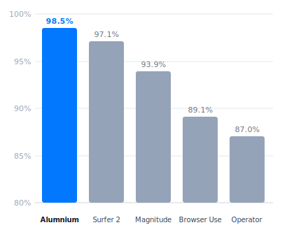
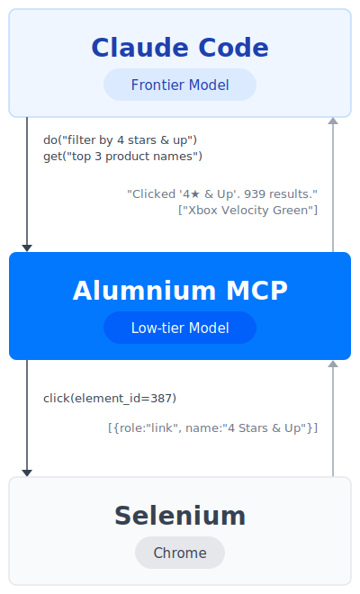

We've been hinting at this in the [0.18 release notes][1].

Today we're publishing the full results: Alumnium MCP used with Claude Code achieves **98.5%** on the [WebVoyager benchmark][2] — a new state of the art, beating the previous best of 97.1% by [Surfer 2][3].

Since Alumnium is an open-source project, we share the full results, including session transcripts, screenshots, and evaluator responses at [webvoyager.alumnium.ai][4]. We also share all code to reproduce the benchmark results in our [WebVoyager fork][10].

## Architecture

Before getting to the results, it's worth framing what kind of agent we're building here — because there are fundamentally two very different ways to approach this.

The first approach is to build a dedicated, fully autonomous browser agent. [Magnitude][5] is a good example: a purpose-built agent that takes a high-level goal, handles all browser interactions internally, and returns an answer. You hand it a task, you wait, you get a result. It's clean and self-contained, but it's a black box: the browsing happens in isolation, separate from whatever else your agent might be doing.

The second approach is to expose browser capabilities directly to a general-purpose agent as tools. Something like [Playwright MCP][13] follows this model. The agent gets access to raw browser primitives — click, type, navigate — and is responsible for driving everything step by step. This gives the agent full control, but at a cost: every browser state update floods the context window with raw accessibility trees, screenshots, and low-level interactions. A complex browsing task can easily derail the main agent from its actual job, trigger compaction and worsen instruction following due to a [context rot][14].

Alumnium sits between these two extremes. As an MCP server, it exposes a small set of high-level tools — `do()`, `get()`, `check()` — that compress the knowledge of _how to browse_ into a single call. The main agent describes what it wants done; Alumnium handles the execution internally and returns a concise description of what changed. The main agent stays focused. Its context window doesn't fill up with browser noise. This is the approach we wanted to validate with WebVoyager.

Claude Code doesn't need to know anything about page structure. It only sees the goal it set and a plain-text summary of what changed. The whole browsing session — accessibility tree traversal, element lookup, click execution — happens inside Alumnium.

## Setup

The benchmark was run with the following components:

- **Claude Code** with Sonnet 4.6 (Pro Plan, $20/month subscription) as the main agent
- **[Alumnium MCP][17] 0.18** with GPT-5 Nano (pay-per-use API key) as the browser subagent
- **[Selenium][15] 4.29** for the majority of websites
- **[undetected-chromedriver][16] 3.5.5** for sites with anti-bot measures (Google Search and a handful of others)

Claude Code was configured to use only Alumnium MCP — no write file system access, no web search, no other tools (`--allowed-tools mcp__alumnium --permission-mode dontAsk`).

The prompt for each task was intentionally minimal: _You are a browser agent for %URL%. %Task%_. For example: _You are a browser agent for https://www.espn.com/. Look up the current leaders in rebounds and assists in the NBA Western Conference on ESPN._

That's the entire prompt. No special instructions about how to use the browser, no retry logic, no task-specific hints. Claude Code figures out when and how to call Alumnium; Alumnium figures out how to execute each browser action.

## Benchmark Changes

The original WebVoyager benchmark is from 2023, so running it today required a few adjustments. We followed the same patching approach used by [Magnitude][5], starting with 590 tasks. As we worked through the dataset, we found 20 tasks they had removed were actually still valid, so we included those too, bringing the total to **610 tasks**.

Here's what we changed and why:

1. **Restored 20 tasks** initially excluded following Magnitude's approach. After reviewing the original removal reasons, we found these tasks were still completable on the live websites. [See the commits][6] for details on each removed task.

2. **Updated date-specific tasks** to use the current year. Many tasks use 2023 references, which would make them unsolvable today. We updated those dates to 2026. [See the changes][7].

3. **Upgraded the evaluator model**. The original benchmark used GPT-4V, which is no longer available. We [switched][8] to GPT-5 and updated its system prompt to [include the current year][9] to avoid false negatives on tasks where the "correct" answer depends on the date.

All changes are tracked in our [WebVoyager fork][10] with commit-level explanations.

## Results

Alumnium with Claude Code achieved **98.5%** on 610 tasks, setting a new state of the art.

The total cost of Alumnium MCP API calls across all 610 tasks was approximately **$5** — less than a cent per task. This does not include the Claude Code Pro subscription ($20/month), but since the same subscription covers all other coding work, it's hard to attribute it entirely to benchmark costs.

You can reproduce the same results by running the [scripts][18] with your own Claude Code.

## Conclusions

A few things stand out from this experiment.

**You don't need a custom browser agent.** Instead of building a dedicated autonomous agent for web tasks, you can use a general-purpose agent like Claude Code and give it Alumnium as a tool. The agent already knows how to plan, reason, and decide. Alumnium handles the browser specifics. The two fit together naturally without any custom orchestration. If you need to support a custom website, you can just prompt Claude Code to issue natural language instructions to Alumnium MCP.

**You might not need a modern browser stack.** The benchmark ran on Selenium — a tool that has been around for 20+ years. For sites that check for bots, undetected-chromedriver, a drop-in Selenium-compatible package, worked just fine. Alumnium is an AI layer on top of existing infrastructure, not a replacement for it. There's no need to switch to Playwright, Chrome DevTools, or custom browsers to get great results.

**Vision isn't a requirement.** Alumnium works primarily from accessibility trees — the structured representation of what's on the page in text form. No screenshots, no pixel coordinates, no computer use. For the vast majority of tasks, structured text gives the model more signal than images while being a fraction of the cost.

**It's remarkably affordable.** Alumnium works best with small, fast models. GPT-5 Nano handled 610 real-world browsing tasks for $5 total. This is only possible because accessibility trees are much cheaper to process than screenshots, and because Alumnium's internal architecture is designed to minimize the number of LLM calls per task. GPT-5 Nano is just one option — Gemini 3.1 Flash Lite, Claude Haiku, and Grok Fast all work equally well. If you'd rather not send data to a third party, Mistral Small runs locally and delivers comparable results.

## What's Next

The next step is submitting these results to the [Steel browser agent leaderboard][11]. We're also planning to evaluate on the [Online Mind2Web benchmark][12]. And since Alumnium already supports Android and iOS via Appium, we'd like to run it against a mobile-specific benchmark as well. Stay tuned!

[1]: /blog/release-0180
[2]: https://arxiv.org/abs/2401.13919
[3]: https://hcompany.ai/surfer-2
[4]: https://webvoyager.alumnium.ai
[5]: https://magnitude.run/webvoyager
[6]: https://github.com/alumnium-hq/WebVoyager/compare/b87f88d30f4649b9c36e762842f24d9cd9ba1aaf...f7768819babe5dd4c82e4db09a52c495c25b77b3
[7]: https://github.com/alumnium-hq/WebVoyager/compare/14fd5b674a0e872f0bc03de1eac87b681571f332...e73fddd2a804309486ea3253949edbfb790fa2a4
[8]: https://github.com/alumnium-hq/WebVoyager/commit/889697b3823bfa9f14c6b9482d22f16b77b7fb47
[9]: https://github.com/alumnium-hq/WebVoyager/commit/d751358ef66b64aa35b9a73852d4bc4c467d17f1
[10]: https://github.com/alumnium-hq/WebVoyager
[11]: https://leaderboard.steel.dev
[12]: https://github.com/OSU-NLP-Group/Online-Mind2Web
[13]: https://github.com/microsoft/playwright-mcp
[14]: https://www.trychroma.com/research/context-rot
[15]: https://www.selenium.dev
[16]: https://github.com/ultrafunkamsterdam/undetected-chromedriver
[17]: /docs/guides/mcp
[18]: https://github.com/alumnium-hq/WebVoyager/blob/alumnium/run_claude_code.py
