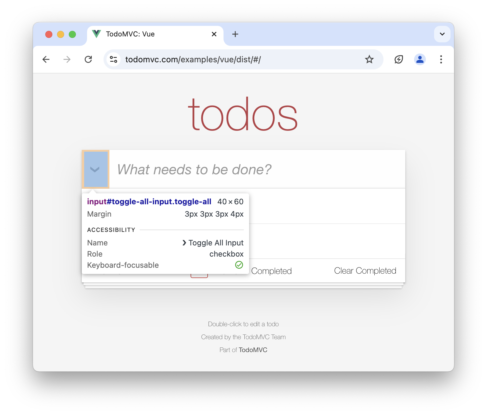
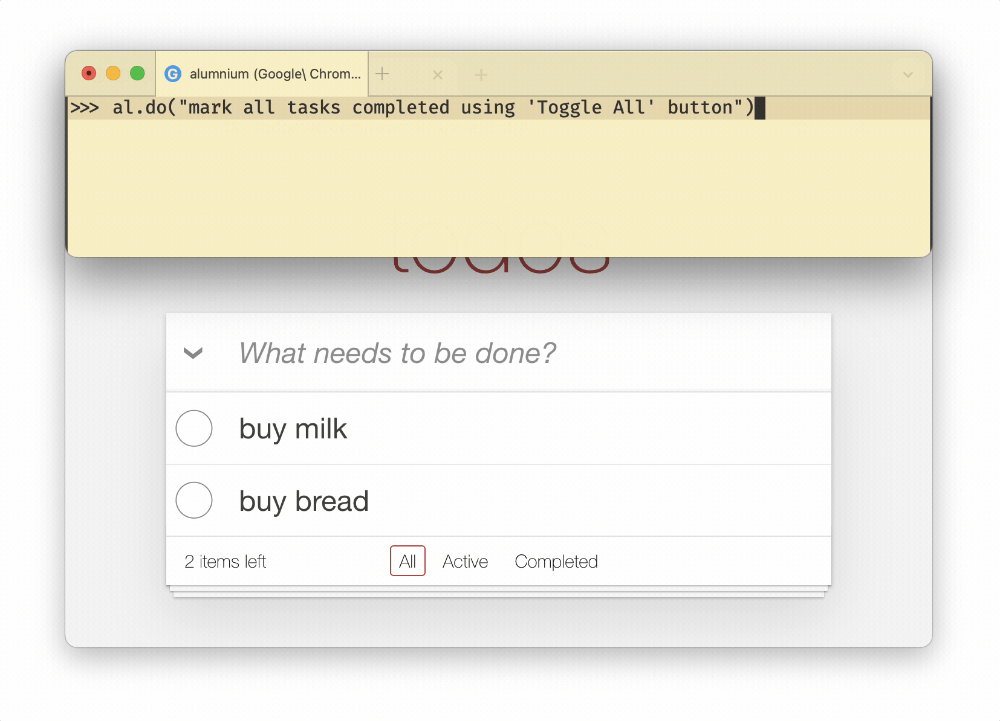
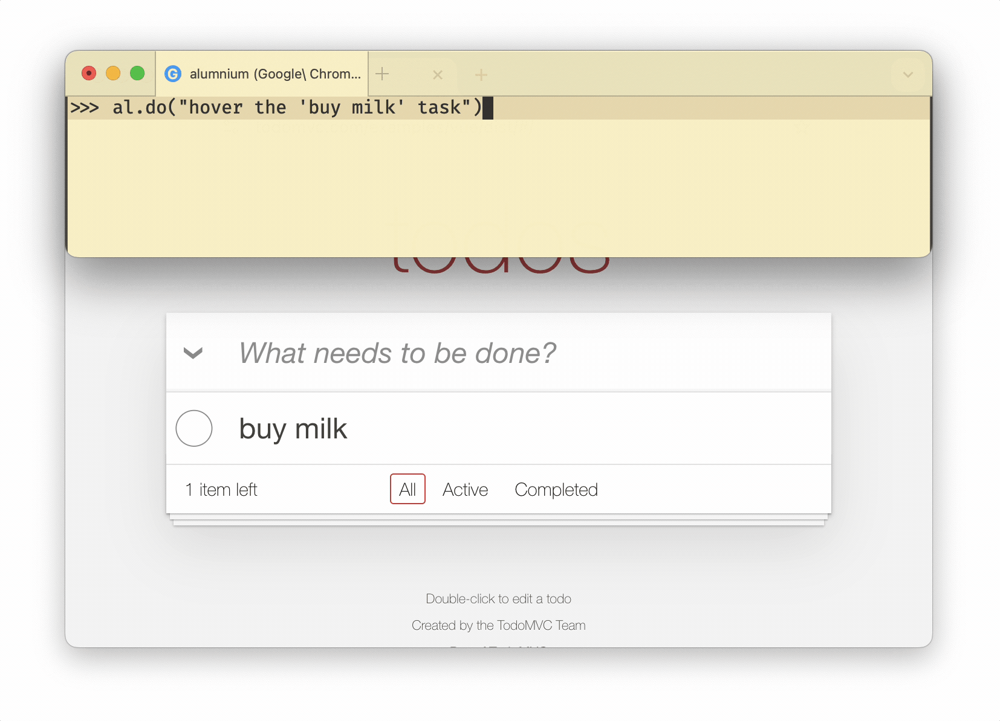

Alumnium is capable of interacting with the web page when you instruct it to **do** something. It analyzes what actions and in which order need to be taken based on the current state of the web page.

For example, if you instruct Alumnium to perform a search on a page with a search box:

```python
al.do("search for Selenium")
```

Alumnium would likely determine that it needs to type "Selenium" into the search box and either press the "Enter" key or click a "Search" button.

## Supported Actions

The following actions are currently supported:

1. Click an element.
2. Drag one element onto another.
3. Hover over an element.
4. Select an option in an element.
5. Type text into an element and press the keyboard keys.

Tailoring instructions for Alumnium takes some time and experimentation and you can achieve the best results by following the guidelines listed below.

## Specific Instructions

Alumnium behaves in a more expected manner when the instructions are more concrete.

For example, imagine you are writing tests for a To-Do application. You would like to test the functionality of completing all tasks at once.



You might attempt to achieve this by the following instruction:

```python
al.do("mark all tasks completed")
```

However, by doing so you permit Alumnium to *mark each task as completed using individual checkboxes near each task*.


There is nothing wrong with this approach because the goal is achieved! Still, you might want to be more concrete and tell *how* exactly you want all tasks to be completed:

```python
al.do("mark all tasks completed using 'Toggle All' button")
```



## One Action At a Time

Alumnium does not (yet) support performing actions that span over multiple page changes, so you need to tailor instructions based on the *current state of the web page*.

For example, the To-Do application you are testing provides a way to delete a task by clicking the **x** button near the task. However, this button is visible only when the user hovers mouse over the task. Because the state of the page changes after hovering, you need to instruct Alumnium twice:

```python
al.do("hover the 'buy milk' task")
al.do("delete the 'buy milk' task")
```



## Flakiness

Alumnium automatically retries actions when errors occur during their execution. This is usually sufficient to handle common scenarios like changes to page content during interaction or issues caused by an overzealous LLM.
