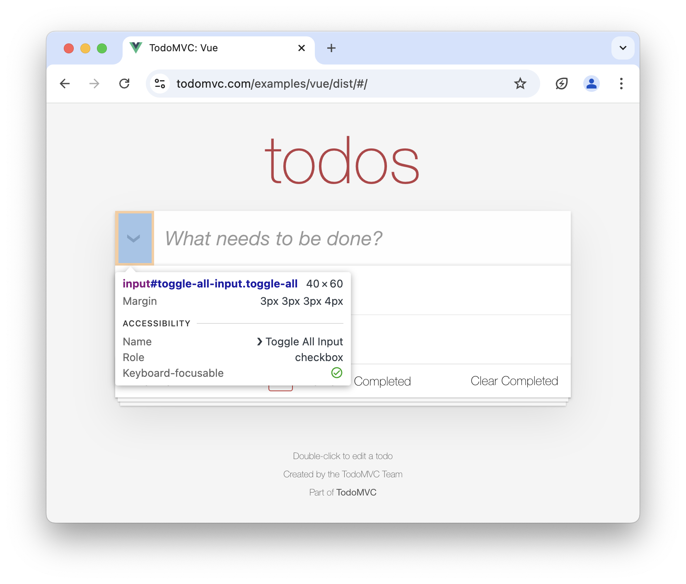

import LanguageContent from "../../../../components/LanguageContent.astro";

Alumnium is capable of interacting with the application when you instruct it to **do** something. It analyzes what actions and in which order need to be taken based on the current state of the mobile or web application.

For example, if you instruct Alumnium to perform a search on a page with a search box:

<LanguageContent lang="python">

```python
al.do("search for 'Mercury element'")
```

</LanguageContent>

<LanguageContent lang="typescript">

```typescript
await al.do("search for 'Mercury element'");
```

</LanguageContent>

Alumnium would likely determine that it needs to type "Mercury element" into the search box and either press the "Enter" key or click a "Search" button.

## Supported Actions

The following actions are currently supported:

1. Click an element.
2. Drag one element onto another.
3. Hover over an element (only web applications).
4. Press the keyboard keys (Enter, Escape, etc).
5. Select an option in a dropdown element.
6. Swipe an element (only mobile applications).
7. Type text into an element.

Tailoring instructions for Alumnium takes some time and experimentation and you can achieve the best results by following the guidelines listed below.

## Specific Instructions

Alumnium behaves in a more expected manner when the instructions are more concrete.

For example, imagine you are writing tests for a To-Do application. You would like to test the functionality of completing all tasks at once.



You might attempt to achieve this by the following instruction:

<LanguageContent lang="python">

```python
al.do("mark all tasks complete")
```

</LanguageContent>

<LanguageContent lang="typescript">

```typescript
await al.do("mark all tasks complete");
```

</LanguageContent>

However, by doing so you permit Alumnium to _mark each task as completed using individual checkboxes near each task_.

<video
  class="rounded-xl"
  alt="A screen recording of Alumnium mark each task completed one by one"
  controls
  controlslist="nofullscreen"
  disablepictureinpicture
  muted
  playsinline
  width="100%"
  height="auto"
>
  <source src="/videos/act-specific-1.mp4" type="video/mp4" />
  <source src="/videos/act-specific-1.webm" type="video/webm" />
</video>

There is nothing wrong with this approach because the goal is achieved! Still, you might want to be more concrete and tell _how_ exactly you want all tasks to be completed:

<LanguageContent lang="python">

```python
al.do("mark all tasks complete using 'Toggle All' button")
```

</LanguageContent>

<LanguageContent lang="typescript">

```typescript
await al.do("mark all tasks complete using 'Toggle All' button");
```

</LanguageContent>

<video
  class="rounded-xl"
  alt="A screen recording of Alumnium mark tasks completed at once"
  controls
  controlslist="nofullscreen"
  disablepictureinpicture
  muted
  playsinline
  width="100%"
  height="auto"
>
  <source src="/videos/act-specific-2.mp4" type="video/mp4" />
  <source src="/videos/act-specific-2.webm" type="video/webm" />
</video>

## One Action At a Time

Alumnium does not (yet) support performing actions that span over multiple page changes, so you need to tailor instructions based on the _current state of the application_.

For example, the To-Do application you are testing provides a way to delete a task by clicking the **x** button near the task. However, this button is visible only when the user hovers mouse over the task. Because the state of the page changes after hovering, you need to instruct Alumnium twice:

<LanguageContent lang="python">

```python
al.do("hover the 'buy milk' task")
al.do("delete the 'buy milk' task")
```

</LanguageContent>

<LanguageContent lang="typescript">

```typescript
await al.do("hover the 'buy milk' task");
await al.do("delete the 'buy milk' task");
```

</LanguageContent>

<video
  class="rounded-xl"
  alt="A screen recording of Alumnium hovering and deleting task"
  controls
  controlslist="nofullscreen"
  disablepictureinpicture
  muted
  playsinline
  width="100%"
  height="auto"
>
  <source src="/videos/act-one-by-one.mp4" type="video/mp4" />
  <source src="/videos/act-one-by-one.webm" type="video/webm" />
</video>

## Teach With Examples

Often, Alumnium cannot determine the proper sequence of actions it needs to perform to achieve a goal. For example, as mentioned above, Alumnium cannot understand what to do when it is told to delete a task.

<video
  class="rounded-xl"
  alt="A screen recording of Alumnium unable to delete task without being taught"
  controls
  controlslist="nofullscreen"
  disablepictureinpicture
  muted
  playsinline
  width="100%"
  height="auto"
>
  <source src="/videos/learn-1.mp4" type="video/mp4" />
  <source src="/videos/learn-1.webm" type="video/webm" />
</video>

You can either provide the exact steps manually each time (see the section above) or teach it once by providing an example.

<LanguageContent lang="python">

```python
al.learn(
  goal='delete "Test" task',
  actions=[
    'hover "Test" task',
    'click "x" button near "Test" task',
  ]
)
```

</LanguageContent>

<LanguageContent lang="typescript">

```typescript
await al.learn({
  goal: 'delete "Test" task',
  actions: ['hover "Test" task', 'click "x" button near "Test" task'],
});
```

</LanguageContent>

From now on, Alumnium knows what to do when told to delete a task.

<video
  class="rounded-xl"
  alt="A screen recording of Alumnium deleting task after being taught"
  controls
  controlslist="nofullscreen"
  disablepictureinpicture
  muted
  playsinline
  width="100%"
  height="auto"
>
  <source src="/videos/learn-2.mp4" type="video/mp4" />
  <source src="/videos/learn-2.webm" type="video/webm" />
</video>

## Extra Tools

Alumnium ships with a set of LLM tools that prove to be most useful for test automation. There are also tools that are disabled by default, but you can enable them (and implement your own) by passing them during initialization:

<LanguageContent lang="python">

```python
from alumnium import Alumni
from alumnium.tools import NavigateBackTool

al = Alumni(driver, extra_tools=[NavigateBackTool])
```

</LanguageContent>

<LanguageContent lang="typescript">

```typescript
import { Alumni, NavigateBackTool } from "alumnium";

const al = new Alumni(driver, { extraTools: [NavigateBackTool] });
```

</LanguageContent>

The following extra tools are currently supported:

| Tool               | Description                                                             |
| ------------------ | ----------------------------------------------------------------------- |
| `NavigateBackTool` | Navigate back to the previous page/screen using the browser/app history |

## Flakiness

Alumnium automatically waits for the following conditions before attempting to perform any action:

1. The HTML document is loaded and ready.
2. Resources on the page are loaded.
3. Document mutations are finished.
4. XHR/fetch requests are finished.

In addition, Alumnium automatically retries actions when errors occur during their execution. This is usually sufficient to handle common scenarios such as changes to page content during interaction or issues caused by an overzealous LLM.
