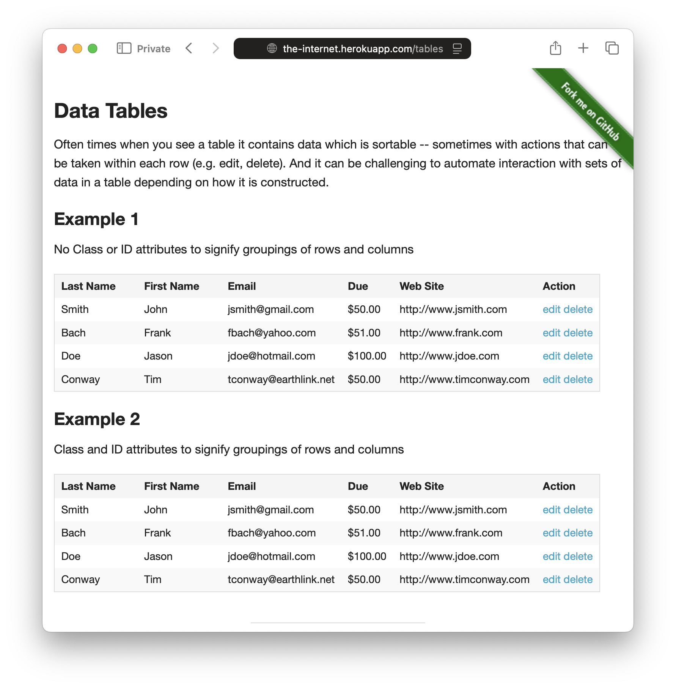

By default, Alumnium operates over the entire application under test. However, this approach can have drawbacks, sometimes resulting in cumbersome and slow tests.

For example, imagine you are testing two similar-looking tables:



Suppose you want to assert data from each table separately. You would need to repeat the table name in each call:

```python
assert al.get("last names from 'Example 1' table") == ["Smith", "Bach", "Doe", "Conway"]
assert al.get("first names from 'Example 1' table") == ["John", "Frank", "Jason", "Tim"]
```

This repetition is not only cumbersome but also affects accuracy and performance, as Alumnium must process the accessibility tree of the **entire** application each time, including both tables. To simplify your tests and improve both accuracy and speed, you can locate an *area* and retrieve data from it instead:

```python
area = al.area("'Example 1' table")
assert area.get("last names") == ["Smith", "Bach", "Doe", "Conway"]
assert area.get("first names") == ["John", "Frank", "Jason", "Tim"]
```

You can use all regular Alumnium methods on areas, including `do`, `get`, and `check`. Once located, the area is not automatically updated when UI of the application changes. This means that you need to re-locate area again so it's fresh:


```python
area = al.area("'Example 1' table")
assert area.get("last names") == ["Smith", "Bach", "Doe", "Conway"]

area.do("sort by last name")
assert area.get("last names") == ["Bach", "Conway", "Doe", "Smith"]  # error

area = al.area("'Example 1' table")  # re-locate the table
assert area.get("last names") == ["Bach", "Conway", "Doe", "Smith"]  # passes
```
