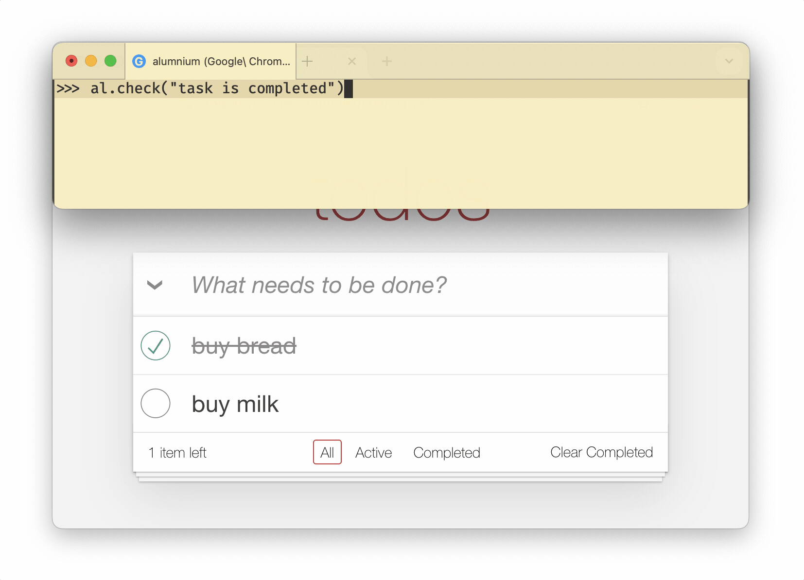
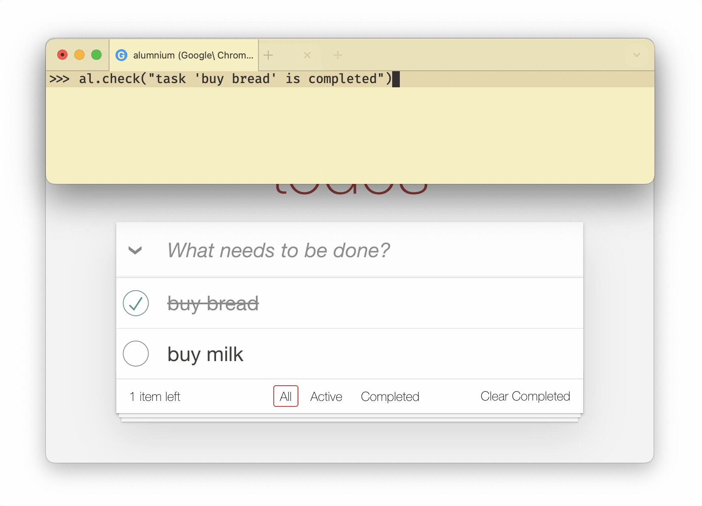
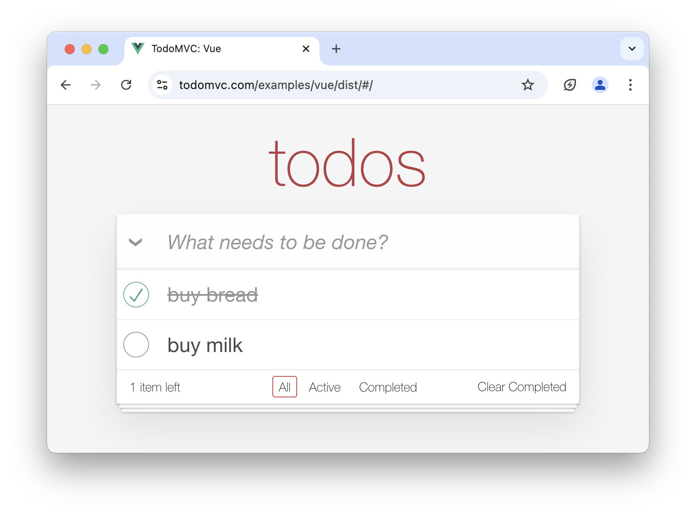

Alumnium can verify statements on the web page when you instruct it to **check** something. It analyzes the current state of the web page, optionally including its screenshot, and decides whether the verification successfully passes or fails.

For example, after performing a Google search for "Selenium", you might want to check that search results contain a link to the Selenium browser automation tool:

```python
al.check("selenium.dev is present in the search results")
```

If the search results don't contain a link to `selenium.dev`, Alumnium raises an assertion error and explains:

```bash wrap
AssertionError: The search results do not include 'selenium.dev'. The results shown in the ARIA tree include links to 'foobar2000', 'Wikipedia', and other related topics, but there is no mention of 'selenium.dev'.
```

### Specific Verifications

Similarly to [actions][1], Alumnium works better when the verifications are concrete.

For example, if you are writing a test for completing tasks in the To-Do application and you don't check the exact task's state, you might end up with contradictory verifications passing at the same time!

```python
al.check("task is completed")
al.check("task is not completed")
```



To avoid false positives in the tests, write more concrete verifications:

```python
al.check("task 'buy bread' is completed")
al.check("task 'buy milk' is not completed")
```




### Vision

:::caution
Vision verifications are significantly more expensive and slower, so resort to them only when needed.
:::

:::note
Meta Llama 3.2 [does not support vision verifications][2] yet.
:::

Occasionally, the web page state is not enough for Alumnium to perform the check. In this case, instruct it to take a screenshot of the page and include it in the verification decision. This is useful when you need to check the visual representation of elements or their spatial relationships.

For example, in your test for the To-Do application, you might need a check that a completed task is shown with a strikethrough style.



```python
al.check("'buy bread' title font style is strikethrough")
```

Without a screenshot, this assertion can fail because there is no indication of font style in the web page itself:

```bash wrap
AssertionError: The ARIA tree does not indicate that the 'buy bread' item has a strikethrough style. It shows that the checkbox for 'buy bread' is checked, which typically indicates that the item is completed, but there is no mention of a strikethrough style in the provided ARIA tree.
```

To make the check more reliable, add a screenshot to it:

```python
al.check("'buy bread' title font style is strikethrough", vision=True)
```

Keep in mind, that the screenshot is taken for the visible part of the page.

### Flakiness

Alumnium automatically retries verification upon an assertion error if the page content is still loading. This is usually sufficient to handle common scenarios like checking for an element that is not yet displayed on the page


[1]: /docs/guides/actions#specific-instructions
[2]: https://github.com/boto/boto3/issues/4374
